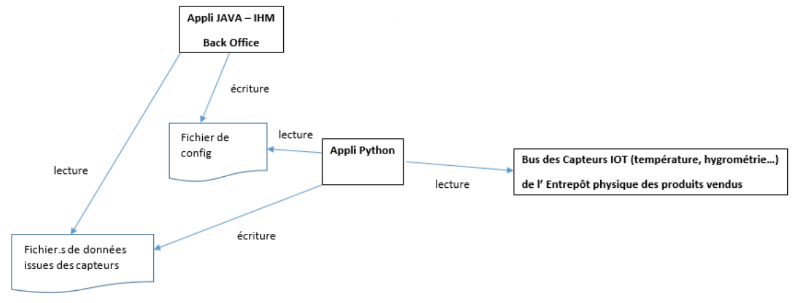

= Documentation technique de l'application IOT
:icons: font
:models: models
:experimental:
:incremental:
:numbered:
:toc: macro
:window: _blank
:correction!:

toc::[]

Version de l'application : V2.0 +
Date : 06/12/2024 +
Equipe : 1A-1 +
Client : BuildMyPC +
Projet : Application de gestion d'entrepôt +

== Description du projet

=== Équipe

L'équipe est composée de cinq membres avec les rôles suivants :

- *Romain* : Product Owner et Développeur
- *Kilian* : Développeur
- *Titouan* : Développeur
- *Pablo* : Développeur
- *Hugo* : Scrum Master et Développeur

=== Contexte du projet

Le projet a pour objectif de développer une application de gestion d’entrepôt pour l’entreprise BuildMyPC, spécialisée dans la vente de composants informatiques et d’ordinateurs montés. Bien que son activité principale ne soit pas le stockage, l’entreprise doit gérer des locaux pour stocker les produits nécessaires à son activité. BuildMyPC souhaite donc intégrer une solution logicielle complémentaire pour surveiller les conditions environnementales de ses entrepôts, telles que la température, l'humidité et le niveau de CO2, afin de garantir la qualité de ses produits. + 
L'application devra également inclure un module pour suivre la production et la consommation énergétique des panneaux solaires de l'entreprise, permettant une gestion optimisée de l’énergie et une approche écoresponsable. Ce projet vise à renforcer l'efficacité opérationnelle de l’entreprise tout en soutenant ses engagements en matière de durabilité.

=== Objectifs du projet

**Problématique :**  

Garantir la fiabilité et l’efficacité de l’application IoT de gestion d’entrepôt pour assurer la qualité des produits et optimiser la gestion énergétique, tout en offrant une expérience utilisateur optimale. +

**Objectifs :**

- Valider le fonctionnement des connexions, des capteurs et des modules énergétiques.

- Assurer l’affichage précis et en temps réel des données, même en cas d’erreurs ou de données manquantes.

- Tester les mécanismes d’alerte et de visualisation pour une prise de décision rapide.

- Renforcer la robustesse du système face aux erreurs et interruptions.

- Aligner l’application avec les objectifs de durabilité et d’efficacité opérationnelle de BuildMyPC.

== Use Case global

L'application est destinée aux utilisateurs suivants :

- **Administrateurs** : Responsables de la configuration des seuils d'alerte, de la sélection des salles surveillées et de la gestion générale du système.
- **Opérateurs** : Personnel chargé de surveiller en temps réel les conditions environnementales et de réagir en cas d'alertes.
- **Techniciens** : En charge de la maintenance des capteurs et de l'infrastructure technique.

Les spécificités de l'application incluent :

- **Surveillance en temps réel** : Les données sont mises à jour constamment, permettant une réaction rapide en cas de problème.
- **Personnalisation** : Possibilité de configurer les seuils d'alerte et les salles à surveiller depuis l'interface utilisateur.
- **Visualisation graphique** : Affichage des données sous forme de graphiques pour une meilleure compréhension.
- **Gestion des alertes** : Notifications en cas de dépassement des seuils, avec enregistrement dans un fichier d'alertes.

== Architecture technique  

=== Vue d'ensemble  
L'application repose sur une architecture modulaire intégrant plusieurs composants pour surveiller les conditions environnementales et gérer les entrepôts de l'entreprise BuildMyPC. +

L’application est composée de deux sous-systèmes principaux :

- Application Java (Frontend) : Développée en Java avec JavaFX, elle constitue l’interface utilisateur graphique pour l’affichage des données, la configuration des paramètres et la visualisation des alertes.

- Scripts Python (Backend) : Chargés de la collecte des données depuis les capteurs via le protocole MQTT, du traitement des données et de la génération des alertes en fonction des seuils définis.

L'application est disponible en installant le fichier "Appli-IOT.zip" dans la https://github.com/IUT-Blagnac/sae-3-01-devapp-G1A-1/releases/tag/V1.0[dernière release] +

=== Analyse
[cols="1,2", options="header"]  
|===  
| Composant | Description  
| MQTT Broker | Serveur central qui gère la communication entre les capteurs et l'application via le protocole MQTT.  
| Interface utilisateur | Module front-end permettant aux utilisateurs de consulter les données et de configurer les seuils. Développé en JavaFX.  
| Back-end | Service développé en Python pour collecter, analyser et stocker les données des capteurs.  
|===  

=== Ressources externes utilisées

- **Paho MQTT** : Bibliothèque pour la communication MQTT en Python.
  - Lien : https://www.eclipse.org/paho/
- **JavaFX** : Framework pour la création d'interfaces graphiques en Java.
  - Documentation : https://openjfx.io/
- **Jackson** : Bibliothèque Java pour le traitement des fichiers JSON.
  - Lien : https://github.com/FasterXML/jackson

== Fonctionnalités principales  

=== Structuration du code source
La structuration des packages suit le model MVC revisité: un **package tool** contient classes outils tel que `DataReader.java`. Le **package controller** contient toutes les classes qui controlent les vues (interface graphique). Les vues sont initialisées avec des fichiers FXML dans un **package view** coté ressources. Et la classe principale qui lance l’application est à l’extérieur de ces packages de même que les alertes. +

Arborescence des fichiers :

* *appli-python* : Application python
** *config.json* : Fichier de configuration des données
** *MQTT.py* : Programme python principale
** *TestConnexion.py* : Programme de test du broker MQTT
* *appli-java* : Application JavaFX
** *src* : Dossier contenant le code source
*** *java* : Dossier contenant le code source java des controllers
**** *application* : Dossier contenant les controllers et les MainFrames
***** *controller* : Dossier contenant le code source java des controllers
***** *autres* : Code source de la mainFrame
**** *tools* : Dossier contenant le code source java des outils
**** *RunApp.java* : Classe java pour start l'application
*** *resources* : Dossier contenant les ressources externes (FXML et images)
**** *application* : Dossier contenant les ressources externes (FXML)
***** *view* : Dossier contenant les codes FXML des pages de l'application
***** *css* : Fichier css utilisé par l'application

=== Éléments essentiels à connaître

- **Gestion des threads** : Utilisation de threads pour l'exécution asynchrone des scripts Python et le rafraîchissement des données sans bloquer l'interface utilisateur.
- **Communication Java-Python** : Les scripts Python sont lancés depuis l'application Java via la classe PythonExecuter, permettant l'interaction entre le frontend et le backend.
- **Fichiers JSONL** : Les données sont stockées sous forme de fichiers JSONL (JSON Lines), facilitant leur lecture séquentielle et leur traitement.

== Fonctionnalités détaillées

=== Visualisation des données en temps réel

**Description** :

- Affichage en temps réel des données de température, d'humidité et de taux de CO₂ pour chaque salle surveillée.

**Classes impliquées** :

- **VisuDonneesController** : Gère l'affichage des données dans l'interface.
- **Salle** : Classe interne représentant une salle et ses données.

**Spécificités** :

- Utilisation de la classe DataReader pour lire les données depuis les fichiers JSONL.
- Mise à jour périodique des données grâce à un Timer et une tâche planifiée.

=== Gestion des alertes

**Description** :

- Génération d'alertes en cas de dépassement des seuils définis dans le fichier de configuration.
- Affichage des alertes à l'utilisateur via l'interface graphique.

**Classes impliquées** :

- **`AlertePopup`** : Gère l'affichage des pop-ups d'alerte.
- **RelancePythonController** : Permet de relancer le script Python en cas de besoin.

**Spécificités** :

- Les alertes sont enregistrées dans LOG_ALERTE.jsonl.
- Utilisation de la méthode showResult pour afficher le résultat de l'exécution des scripts Python.

=== Configuration de l'application

**Description** :

- Permet aux administrateurs de configurer les paramètres de l'application, tels que les seuils d'alerte, les salles surveillées et les types de données à afficher.

**Classes impliquées** :

- **MenuConfigController** : Gère la configuration de l'application.
- **GlobalVariables** : Contient les chemins des fichiers de configuration et des scripts Python.

**Spécificités** :

- Lecture et écriture du fichier config.json pour sauvegarder les paramètres.
- Méthodes `saveConfiguration` et `createUI` pour gérer l'interface de configuration.

=== Suivi de la production solaire

**Description** :

- Affichage des données de production et de consommation des panneaux solaires de l'entreprise.

**Classes impliquées** :

- **ShowSolarController** : Gère l'affichage des données solaires.
- **`DataReader`** : Utilisé pour lire les données des panneaux solaires depuis les fichiers JSONL.

**Spécificités** :

- Les données sont collectées par le script Python MQTT.py et stockées dans solar.
- Visualisation des données sous forme de graphiques générés avec JavaFX.

== Procédures d'installation

=== Installation pour le développement

1. **Prérequis** :

   - **Java Development Kit (JDK) 17** : Assurez-vous que le JDK est installé sur votre système.
   - **Python 3.11.9+** : Pour l'exécution des scripts Python.
   - **Maven** : Pour la gestion des dépendances Java.

2. **Cloner le dépôt du projet** :

[source,bash]
----
git clone https://github.com/IUT-Blagnac/sae-3-01-devapp-G1A-1.git
----

3. **Installation des dépendances Python** :

[source,bash]
----
pip install paho-mqtt
----

4. **Importation du projet Java** :

   - Ouvrez votre IDE (Eclipse, IntelliJ IDEA, etc.).
   - Importez le projet Maven à partir du répertoire appli-java.

5. **Configuration du projet** :

   - Assurez-vous que le chemin vers le JDK est correctement configuré.
   - Vérifiez que les dépendances Maven sont bien téléchargées.

6. **Exécution de l'application** :

   - Lancez la classe principale RunApp pour démarrer l'application Java.
   - Exécutez le script Python MQTT.py situé dans appli-python pour démarrer la collecte des données.

=== Installation pour le poste utilisateur final

1. **Prérequis** :

   - **Java Runtime Environment (JRE) 17** : Nécessaire pour exécuter l'application Java.
   - **Python 3.11.9+** : Pour les scripts de collecte de données.
   - **Bibliothèques Python** : Paho MQTT

2. **Installation de l'application Java** :

   - Téléchargez le fichier exécutable `Appli-IOT.jar`.
   - Placez-le dans un répertoire dédié.

3. **Installation des scripts Python** :

   - Copiez le dossier appli-python sur le poste utilisateur.
   - Installez les dépendances avec :

[source,bash]
----
pip install paho-mqtt
----

4. **Configuration** :

   - Modifiez le fichier config.json pour adapter les paramètres aux besoins spécifiques.

5. **Exécution** :

   - Lancez le script Python MQTT.py :

[source,bash]
----
python3 MQTT.py
----

   - Exécutez l'application Java :

[source,bash]
----
java -jar Appli-IOT.jar
----

=== Fichier de configuration  

Le fichier `config.json` contient les paramètres personnalisables, notamment les seuils de température et d'humidité :  

[source,json]  
----  
{
    "max": {
        "temperature_max": 20,
        "humidite_max": 60,
        "taux_max": 1200
    },
    "salle": {
        "num_salle": "B001,B002,B004,B005,B006"
    },
    "lecture": {
        "frequence": 15
    },
    "donnee": {
        "temperature": true,
        "humidite": true,
        "taux": true
    }
}
----  

Ajoutez (salles) ou modifiez les paramètres selon vos besoins avant de démarrer l’application. La configuration sera possible depuis l'application de manière plus intuitive.  

== Tests et Validation  

=== Tests automatiques  
Des scripts Python sont fournis pour valider les composants essentiels :  

- **Test du Broker MQTT :**  Vérifie la connexion au broker et la réception des messages en exécutant le fichier `TestConnexion.py`.  

- **Validation de la configuration :**  S’assure que le fichier `config.json` est bien formaté et respecte les seuils attendus en le paramétrant depuis l'app Java `Configuration de l'application`.  

=== Tests manuels  
- Simulez une alerte en envoyant des données MQTT dépassant les seuils définis dans `config.json`.  
- Vérifiez l’affichage des données dans l’interface utilisateur et la génération d’alertes.  

== Maintenance et Support  

=== Surveillance des logs  
Les logs système sont enregistrés dans les dossiers `datas` et `alert`.  

=== Mise à jour  
==== **Mettre à jour les dépendances Python :**  Utilisez la commande suivante pour mettre à jour toutes les bibliothèques Python :  
[source,bash]
----
pip install --upgrade <package_name>
----

==== **Lancer l'interface utilisateur :**  Exécuter l'application Java
[source,bash]
----
java RunApp.java
---- 

=== Références

- **Dépôt GitHub** : https://github.com/IUT-Blagnac/sae-3-01-devapp-G1A-1
- **Documentation JavaFX** : https://openjfx.io/
- **Documentation Paho MQTT** : https://www.eclipse.org/paho/

=== Contact  
Pour toute assistance ou retour, contactez l'équipe technique via l’adresse suivante :  
`support@buildmypc.com`. 
