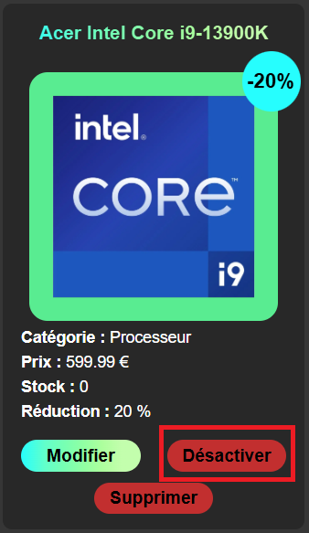
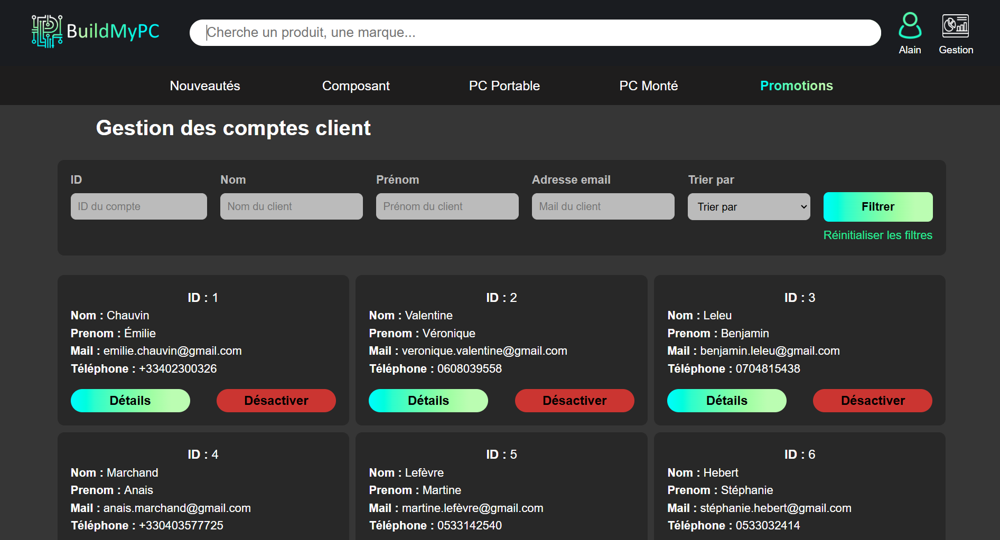
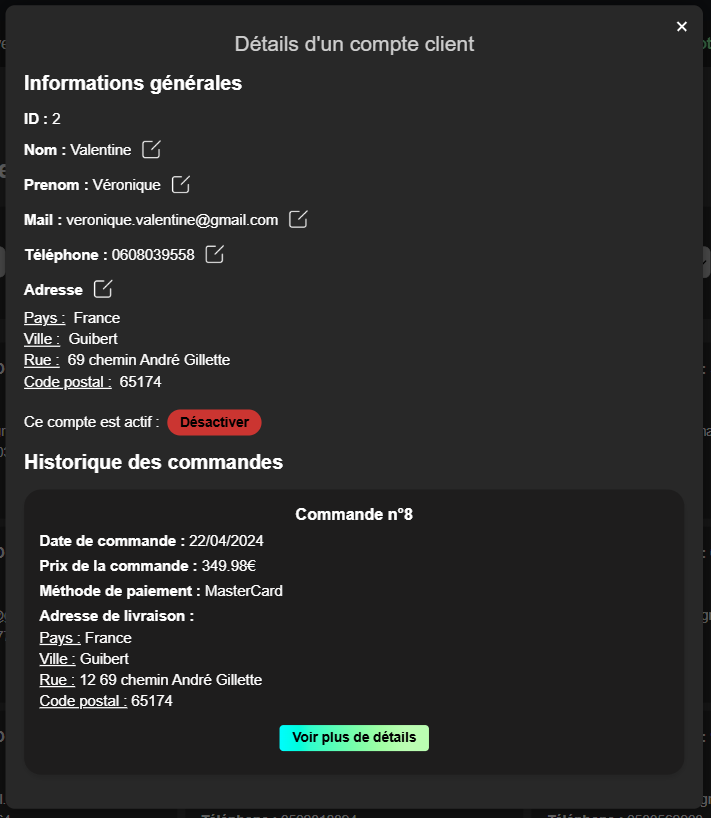
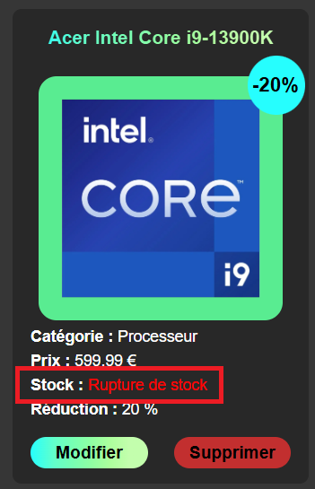

= Documentation utilisateur (employés/administrateurs) du site web
:icons: font
:models: models
:experimental:
:incremental:
:numbered:
:toc: macro
:window: _blank
:correction!:

toc::[]

Version du site : V3.0 +
Date : 18/12/2024 +
Equipe : 1A-1 +
Client : BuildMyPC +
Projet : Site web e-commerce +

== Description du projet

=== Équipe

L'équipe était composée de cinq membres avec les rôles suivants :

- *Romain* : Product Owner et Développeur
- *Kilian* : Développeur
- *Titouan* : Développeur
- *Pablo* : Développeur
- *Hugo* : Scrum Master et Développeur

=== Contexte du projet

Le projet a pour objectif de développer une solution e-commerce pour l’entreprise **BuildMyPC**, spécialisée dans la vente de composants informatiques et d’ordinateurs montés. L’entreprise souhaite élargir son marché en passant d’un modèle B2B à une offre B2C, ciblant les particuliers pour augmenter sa visibilité et sa part de marché en Europe.

=== Objectifs du projet

**Problématique :**  
Garantir la fiabilité et l’efficacité du site web de e-commerce afin d’optimiser l’expérience utilisateur, d’améliorer la gestion des commandes et de répondre aux besoins des clients de manière rapide et intuitive, tout en respectant les contraintes techniques et opérationnelles.

**Objectif :**  

Validation technique :

- Assurer le bon fonctionnement de la navigation sur le site, y compris sur différents navigateurs et appareils (desktop, mobile).
- Vérifier l’intégration des bases de données pour le stockage des produits, commandes, et comptes utilisateurs.

Expérience utilisateur :

- Concevoir une interface ergonomique et intuitive pour permettre une navigation fluide et efficace.
- Mettre en place des fonctionnalités essentielles, telles que la recherche par catégorie, les filtres, et un processus de commande simplifié.

Affichage et contenu :

- Garantir un affichage rapide et cohérent des pages produit, des descriptions, et des visuels, même en cas de forte affluence sur le site.
- Optimiser le contenu pour une meilleure accessibilité et un référencement naturel (SEO) performant.

Fonctionnalités clés :

- Tester les mécanismes de gestion des paniers, des paiements sécurisés et des confirmations de commande en temps réel.
- Implémenter des outils de suivi des commandes et de communication avec les clients (notifications, suivi des livraisons).

Robustesse et sécurité :

- Renforcer la sécurité du site web pour protéger les données sensibles des utilisateurs (RGPD, protection contre les attaques).
- Garantir la disponibilité et la stabilité du site face à des pics de trafic ou à des interruptions techniques.

Alignement avec les objectifs de l’entreprise :

- Créer un site qui reflète les valeurs et les objectifs commerciaux de BuildMyPC.
- Permettre une gestion efficace des stocks et des commandes pour soutenir la croissance de l’activité e-commerce.

== Fonctionnement du projet Web

Pour des informations supplémentaires :

- Documentation technique : link:document_technique_web.adoc[Lien]

== Fonctionnalités pour les employés

=== Répondre à des avis

Sur la page de détail d'un produit, vous pouvez répondre aux avis laissés par des clients. Si un cet avis a déjà une réponse, vous ne pouvez pas en ajouter une autre.

image::images/doc_user_web/employee_answer_written.png[réponse écrite]

=== Gérer des événements spéciaux

Une fois connecté, et en tant qu'employé ou administrateur, cliquez sur le logo du tableau de bord situé en haut à droite de votre écran.

Vous arriverez sur cette page et pourrez cliquer sur 'Gestion des promotions':

image::images/doc_user_web/event2.png[Event2]

Vous voilà sur la page des promotions côté employés:

image::images/doc_user_web/event3.png[Event3]

Pour gérer une promotion, cliquez sur 'Modifier':

image::images/doc_user_web/event4.png[Event4]

Vous serez ensuite invité à modifier uniquement la réduction:

Enfin, après validation, un popup vous informera de la réussite ou non de la modification:

image::images/doc_user_web/event6.png[Event6]

Il vous sera également possible de désactiver une promotion en cliquant sur le bouton 'Désactiver':

Puis validez en cliquant sur le bouton 'OUI':

Enfin, le popup de validation:

image::images/doc_user_web/event9.png[Event9]

=== Gérer les produits et catégories du site

Pour gérer les produits, même étape que pour la gestion, sauf qu'une fois sur la page de choix de la gestion, vous cliquerez sur 'Gestion des produits' :

Vous arriverez ici :

Pour créer un nouveau produit, cliquez ici :

image::images/doc_user_web/gestion_prod3.png[Produit3]

Remplissez le formulaire :

Le popup de validation arrive, c'est donc bien créé :

image::images/doc_user_web/gestion_prod5.png[Produit5]

Vous pouvez également modifier un produit déjà présent :

Changez les informations que vous souhaitez et cliquez sur Enregistrer :

image::images/doc_user_web/gestion_prod7.png[Produit7]

Puis, le popup de réussite s'affiche :

=== Créer des événements spéciaux

Pour la création d'un événement, même étape que pour la gestion, sauf qu'une fois sur la page de gestion, il vous faudra cliquer sur 'Ajouter un produit à la promotion':

Remplissez le formulaire, qui se complétera automatiquement une fois le produit sélectionné:

image::images/doc_user_web/event11.png[Event11]

Puis, le popup de réussite apparaîtra:

image::images/doc_user_web/event12.png[Event12]

== Fonctionnalités pour les administrateurs

=== Gérer les comptes des employés

Pour gérer les comptes des employés, allez sur la page de gestion et cliquez sur 'Gestion des employés' :

Une fois sur la page de gestion des employés, vous aurez accès à la liste de tous les employés. vous pourrez effectuer les actions suivantes : 

- Ajouter un nouvel employé,
- Modifier les informations d'un employé existant,
- Supprimer le compte d'un employé.

A noter, en tant qu'administrateur il n'est pas possible de modifier ou de supprimer les informations d'un autre administrateur.

==== Ajout d'un nouvel employé

En cliquant sur le bouton un formulaire va s'afficher. Vous allez pouvoir remplir les différentes informations du nouvel employé puis les valider. Vous serez arrêté avant la validation si certaines informations ne sont pas valides. S'il reste des erreurs après, vous recevrez un message qui vous signalera d'où provient le problème.

image::images/doc_user_web/employee_management_new_with_infos_filled.png[formulaire rempli nouvel employé]

Quand l'ajout est réussit, il vous le sera indiqué avec un popup d'information.

==== Modification des informations d'un employé

En cliquant sur le bouton un formulaire prérempli avec les informations de l'employé va s'afficher. Vous allez pouvoir modifier les différentes informations de employé puis les valider. Vous serez arrêté avant la validation si certaines informations ne sont pas valides. S'il reste des erreurs après, vous recevrez un message qui vous signalera d'où provient le problème. Vous ne pouvez pas modifier le mot de passe d'un employé et vous ne pouvez pas modifier les informations d'un administrateur.

==== Suppression d'un compte employé

image::images/doc_user_web/employee_management_zoom_btn_suppr.png[bouton supprimer un employé]

En cliquant sur le bouton, un popup de confirmation va être affiché à l'écran. Vous recevrez ensuite un message pour vous informer du succès ou de l'échec de l'opération.

=== Gérer les comptes clients

Pour gérer les comptes des clients, allez sur la page de gestion et cliquez sur 'Gestion des comptes clients' :

Une fois sur la page de gestion des comptes client, vous aurez accès à la liste de tous les clients. vous pourrez effectuer les actions suivantes : 

- Rechercher un client avec différentes options de tri,
- Voir les détails d'un compte,
- Modifier certaines informations d'un compte,
- Désactiver/Réactiver un compte.

==== Rechercher un client

Vous pouvez utiliser la barre recherche pour ne selectionner qu'un seul ou plusieurs clients précis. Vous pouvez aussi réinitialiser votre recherche pour afficher tous les clients à nouveau. Vous pouvez aussi utiliser différentes options de tri pour afficher les clients dans l'ordre que vous souhaitez.

==== Voir les détails d'un compte

Vous pouvez voir les informations d'un client en cliquant sur le bouton "Détails". Une page s'affichera et vous pourrez voir les informations suivantes : 

- L'ID du client,
- Le nom du client,
- Le prénom du client,
- L'adresse email du client,
- Le numéro de téléphone,
- L'adresse du client,
- L'état du compte (actif ou désactivé),
- L'historique de commande du client.

==== Modifier les informations d'un compte

Depuis la page de détail client, vous pourrez modifier les ses informations en cliquant sur le bouton 

Vous ne pouvez pas modifier les informations qui ne possèdent pas ce bouton.

Lorsque vous modifiez une information, une vérification sera faite avant la validation et un popup vous indiquera si l'opération à été réussite ou non.

==== Désactiver/Réactiver un compte

Vous pouvez désactiver ou réactiver un compte directement depuis la page de gestion des comptes client ou depuis la page de détail d'un client. Lorsqu'un compte est désactivé, il n'est pas possible de se connecter avec.

Lors qu'un compte est actif, le bouton "Désactiver" sera affiché. A l'inverse, lorsqu'un compte est désactivé, le bouton "Réactiver" sera affiché.

Compte actif : 

Compte désactivé : 

Lorsque vous souhaitez activer ou désactiver un compte, vous recevrez un message de confirmation. Vous recevrez ensuite un message pour vous informer de la réussite (ou l'échec) de l'opération.

Désactivation d'un compte :

Réactivation d'un compte :

image::images/doc_user_web/client_m_enabled_popup.png[résultat de réactivation]

=== Gérer les produits et catégories du site

Un administrateur, en plus des options accessibles par l'employé sur la partie produit, pourra supprimer le produit :

Pour supprimer le produit, cliquez ici :

Puis, validez :

image::images/doc_user_web/gestion_prod10.png[Produit10]

Enfin, le popup apparaît :

=== Gérer les stocks

Un administrateur, en plus des options accessibles par l'employé sur la partie produit, pourra modifier les stocks :

Il lui suffit de cliquer sur "Modifier" sur l'article de son choix. De plus, un visuel rouge apparaît sur les articles sans stock :

Dans le formulaire, une case "Stock" est remplissable pour le réajuster :

Il lui suffira de valider pour restocker :

== Support et Contact
Pour toute question ou assistance, veuillez contacter notre support client à l'adresse suivante: *support@buildmypc.com*

== Conclusion
Nous espérons que cette documentation vous aidera à tirer le meilleur parti du site web BuildMyPC.
