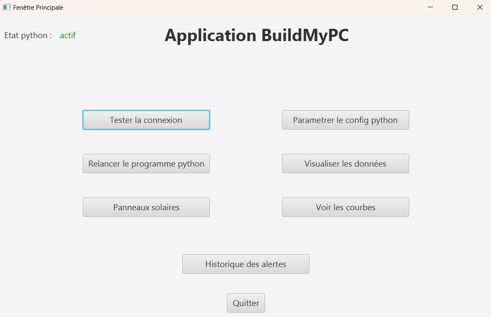
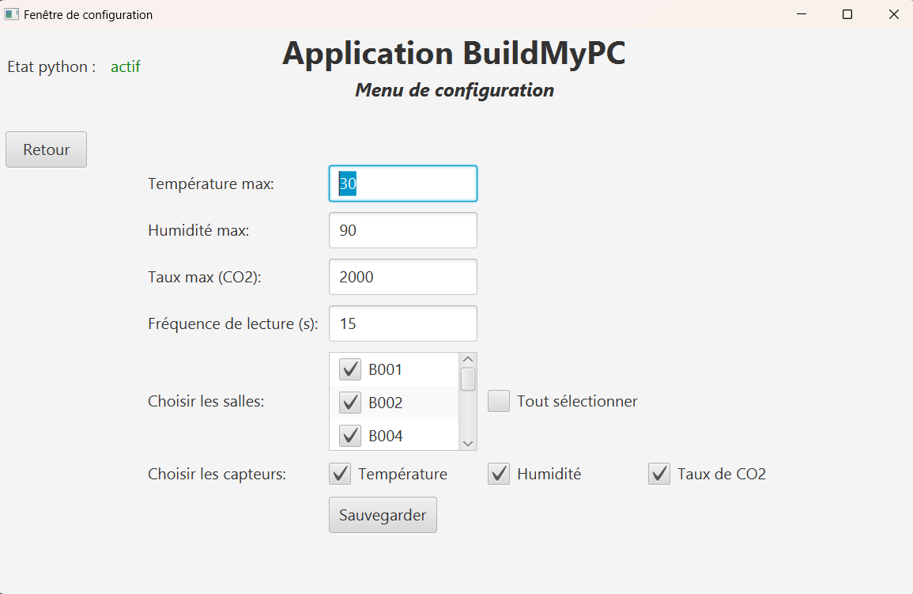
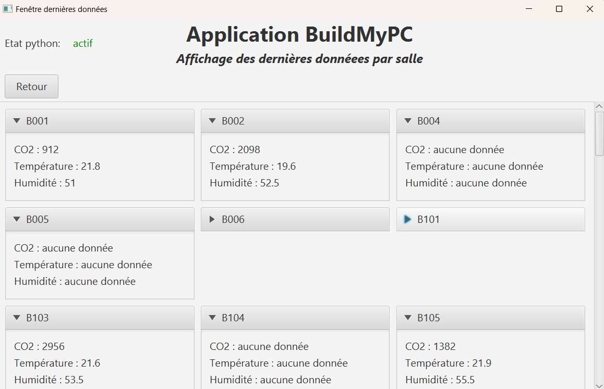
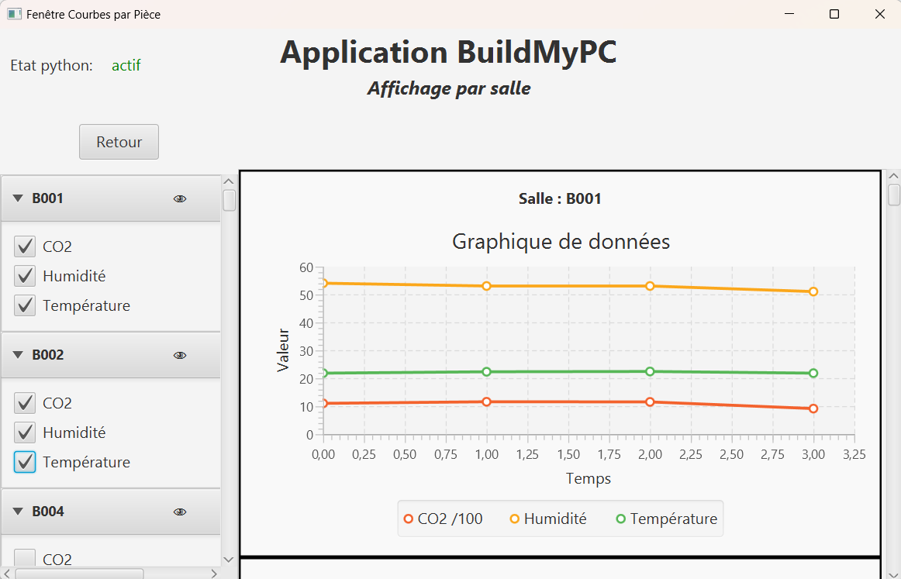
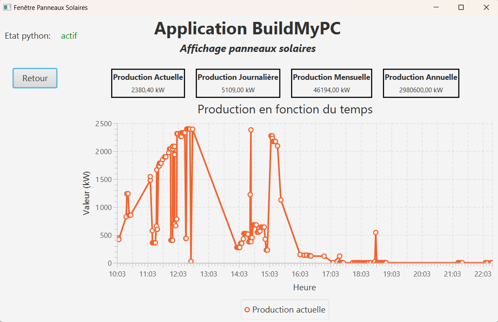
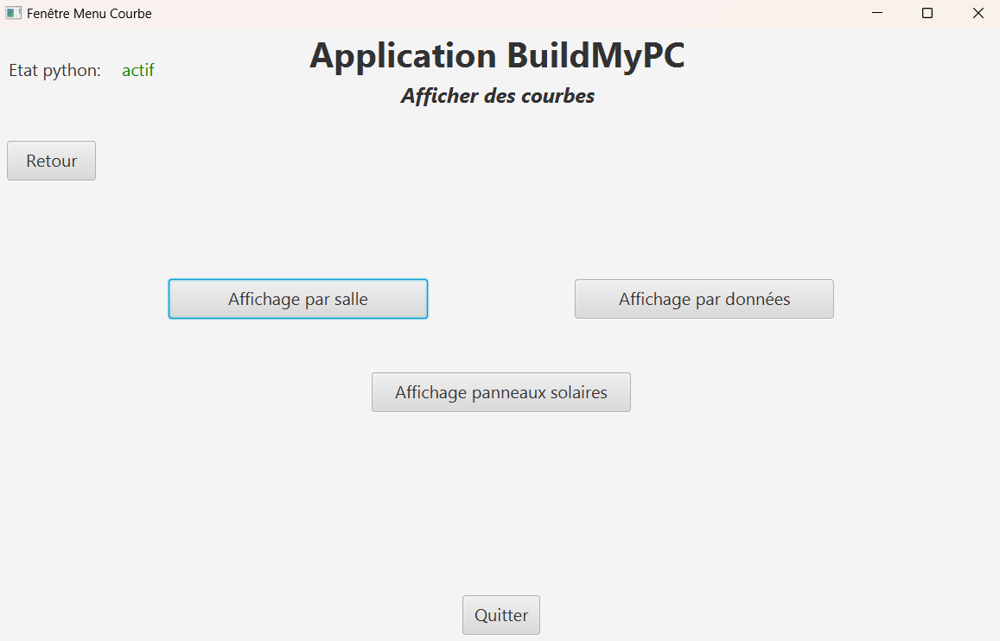
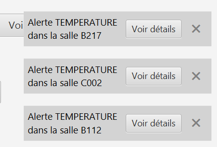
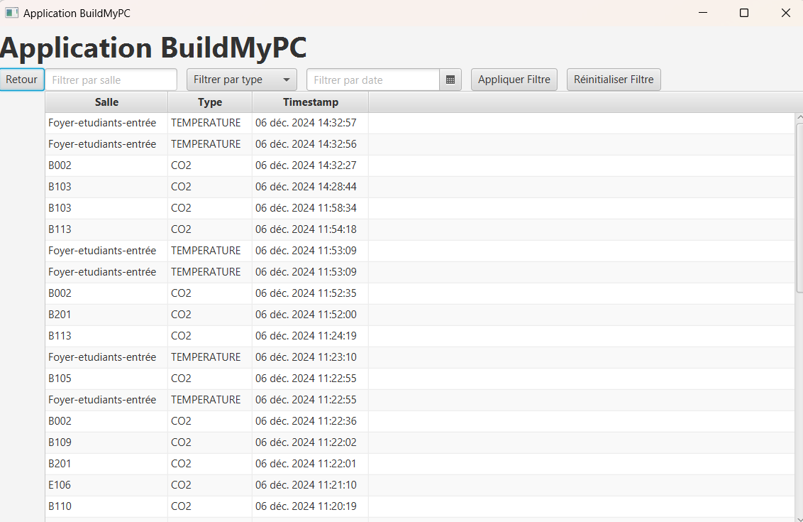

= Documentation utilisateur de l'application IOT
:icons: font
:models: models
:experimental:
:incremental:
:numbered:
:toc: macro
:window: _blank
:correction!:

toc::[]

Version de l'application : V1.0 +
Date : 06/12/2024 +
Equipe : 1A-1 +
Client : BuildMyPC +
Projet : Application de gestion d'entrepôt +

== Description du projet

=== Équipe

L'équipe est composée de cinq membres avec les rôles suivants :

- *Romain* : Product Owner et Développeur
- *Kilian* : Développeur
- *Titouan* : Développeur
- *Pablo* : Développeur
- *Hugo* : Scrum Master et Développeur

=== Contexte du projet

Le projet a pour objectif de développer une application de gestion d’entrepôt pour l’entreprise BuildMyPC, spécialisée dans la vente de composants informatiques et d’ordinateurs montés. Bien que son activité principale ne soit pas le stockage, l’entreprise doit gérer des locaux pour stocker les produits nécessaires à son activité. BuildMyPC souhaite donc intégrer une solution logicielle complémentaire pour surveiller les conditions environnementales de ses entrepôts, telles que la température, l'humidité et le niveau de CO2, afin de garantir la qualité de ses produits. + 
L'application devra également inclure un module pour suivre la production et la consommation énergétique des panneaux solaires de l'entreprise, permettant une gestion optimisée de l’énergie et une approche écoresponsable. Ce projet vise à renforcer l'efficacité opérationnelle de l’entreprise tout en soutenant ses engagements en matière de durabilité.

=== Objectifs du projet

**Problématique :**  

Garantir la fiabilité et l’efficacité de l’application IoT de gestion d’entrepôt pour assurer la qualité des produits et optimiser la gestion énergétique, tout en offrant une expérience utilisateur optimale. +

**Objectifs :**

- Valider le fonctionnement des connexions, des capteurs et des modules énergétiques.

- Assurer l’affichage précis et en temps réel des données, même en cas d’erreurs ou de données manquantes.

- Tester les mécanismes d’alerte et de visualisation pour une prise de décision rapide.

- Renforcer la robustesse du système face aux erreurs et interruptions.

- Aligner l’application avec les objectifs de durabilité et d’efficacité opérationnelle de BuildMyPC.

== Installer l'application
=== Prérequis
* Système d'exploitation Windows
* Installer les applications dans un répertoire dans lequel on a les droits de créer des nouveaux fichiers
* Toujours avoir l'application java dans un fichier à coté de appli-python
* Avoir java 17 installé sur sa machine

=== Installation
==== Java
https://www.oracle.com/java/technologies/javase/jdk17-archive-downloads.html[Lien pour télécharger java version 17]

==== Python
Version recommandée : 3.11

https://www.python.org/downloads/release/python-31111/[Lien pour télécharger python version 3.11.11]

L'application python utilise le module paho-mqtt pour communiquer avec les capteurs, pour l'installer, allez dans un terminal (ex : cmd) et executez la commande suivante : 

`pip install paho-mqtt`

Pour récupérer l'application, rendez-vous la dernière release (ou cliquez https://github.com/IUT-Blagnac/sae-3-01-devapp-G1A-1/releases/latest[ici]) et téléchargez le fichier Application_Controle_Capteur.zip, puis décompressez-le.

Pour lancer l'application, double-cliquez sur le fichier AppliJava-1.0-shaded. L'application peut mettre du temps à démarrer si il y a un problème avec le script python.

== Utiliser l'application

=== Fonctionnement général

*_Figure 1 :* Menu principal de l'application_

Les boutons Tester la connexion et relancer le python permettent respectivement de tester si la connexion fonctionne (donc si on peut recevoir des données) et de relancer le programme python mqtt qui va récupérer les données des capteurs. L'état actuel de ce programme python est affiché en haut à gauche de chaque fenêtre de l'application. Relancer le programme python permet de le faire démarrer si il y avait une erreur lors du lancement initial ou de lui appliquer les changements apportés au fichier de configuration.

Le bouton parametrer le config python permet de changer les filtres du programme python. Cette partie est expliquée plus en détail dans la section Configuration.

Le bouton Historique des alertes permet d'afficher une liste des alertes enregistrée. Cette partie est expliquée plus en détail dans la section Alertes.

Le reste des boutons permet de visualiser les données enregistrées de différentes manières. Cette partie est expliquée plus en détail dans la section Visualisation.

=== Configuration

*_Figure 2 :* Fenêtre de configuration du fichier config_

Cette fenêtre vous permet de selectionner quelles données sont à récuperer par le fichier python et quels sont les seuils des alertes. Les informations saisissables sont donc dans l'ordre : 

- Température max : le seuil de température à ne pas dépasser.

- Humidité max : le seuil d'humidité à ne pas dépasser.

- Taux max (CO2) : le seuil à ne pas dépasser pour le taux de CO2.

- Salles : les salles dont les données seront enregistrées.

- Capteurs : les types de donnnées enregistrées (Température, Humidité, Taux).

*Note :* Lors que l'on modifie le config, il faut relancer le programme python pour que les changements s'appliquent. Le programme peut être relancé via le menu principal.

=== Visualisation

==== Données des capteurs des salles

Les données peuvent être visualisées de plusieurs manières : 

- Dernières données par salle : affiche une liste de salle avec leur dernières données récupérées. Si le fichier est introuvable ou la donnée absente "aucune donnée" est affiché à la place. Pour visualiser les données sous cette forme, il faut cliquer sur Visualiser les données dans le menu principal.

*_Figure 3 :* Fenêtre d'affichage des dernières données par salle_

- Graphiques par salle : affiche un graphique par salle. A gauche, il est possible de sélectionner les données que l'on souhaite afficher sur une salle. Il est possible de masquer une salle. Lorsqu'une donnée est absente, elle n'est pas affichée sur le graphique. Le taux de CO2 est divisé par 100 pour que les autres données restent lisible. Pour obtenir le bon taux de CO2 il faut donc multiplier la valeur par 100. Pour visualiser les données sous cette forme, il faut cliquer sur Voir les courbes dans le menu principal puis Affichage par salle.

*_Figure 4 :* Fenêtre d'affichage des données par salle_

- Graphiques par données : affiche un graphique par données. A gauche, il est possible de sélectionner les salles sur lequelles on veut afficher les données. Il est possible de masquer une donnée. Certaines salles ne contiennent pas de données mais elles sont tout de même affichées. Pour visualiser les données sous cette forme, il faut cliquer sur Voir les courbes dans le menu principal puis Affichage par données.

image::images/doc_user_iot/fenetreAffichageParDataJava.png[Affichage des données par salle]
*_Figure 5 :* Fenêtre d'affichage des graphiques par données_

==== Données des capteurs solaire

Pour visualiser ces données, il faut cliquer sur Panneaux solaires dans le menu principal ou sur Voir les courbes dans le menu principal puis Affichage panneaux solaire.

*_Figure 6 :* Fenêtre d'affichage des données solaire_

*_Figure 7 :* Fenêtre Voir les courbes_

=== Alertes

Des alertes peuvent survenir lorsque les données enregistrées dépassent un certain seuil défini dans le config. Lorsque cela arrive, une alerte apparait en bas à droite de l'écran et disparait après 10 secondes. L'alerte propose de rediriger vers la page Historique des alertes qui affiche l'entièreté des alertes enregistrées. Ces alertes peuvent être triées par type, salle et date.

*_Figure 8 :* Exemple d'alerte_

*_Figure 8 :* Fenêtre historique des alertes_
