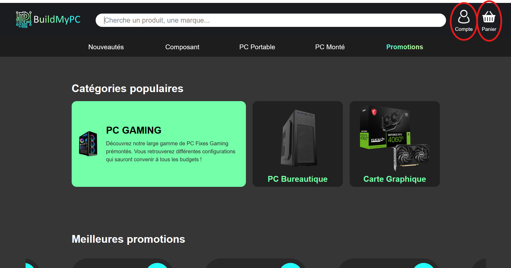
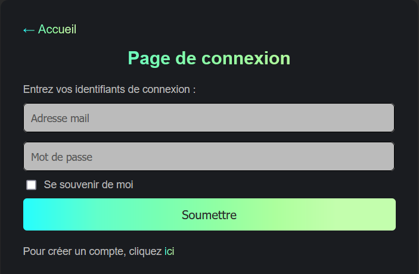
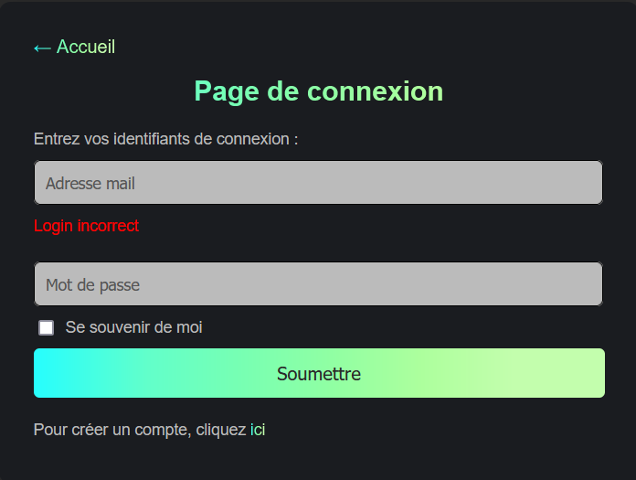
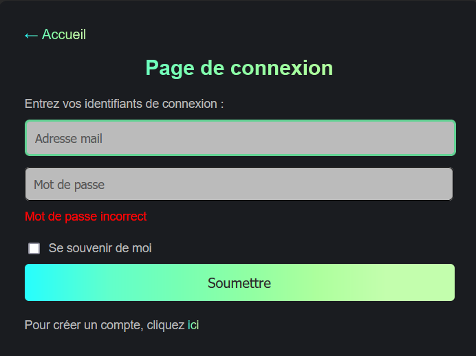
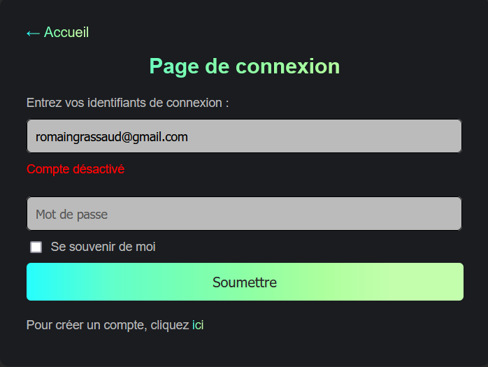

= Documentation utilisateur (client) du site web
:icons: font
:models: models
:experimental:
:incremental:
:numbered:
:toc: macro
:window: _blank
:correction!:

toc::[]

Version du site : V3.0 +
Date : 18/12/2024 +
Equipe : 1A-1 +
Client : BuildMyPC +
Projet : Site web e-commerce +

== Description du projet

=== Équipe

L'équipe était composée de cinq membres avec les rôles suivants :

- *Romain* : Product Owner et Développeur
- *Kilian* : Développeur
- *Titouan* : Développeur
- *Pablo* : Développeur
- *Hugo* : Scrum Master et Développeur

=== Contexte du projet

Le projet a pour objectif de développer une solution e-commerce pour l’entreprise **BuildMyPC**, spécialisée dans la vente de composants informatiques et d’ordinateurs montés. L’entreprise souhaite élargir son marché en passant d’un modèle B2B à une offre B2C, ciblant les particuliers pour augmenter sa visibilité et sa part de marché en Europe.

=== Objectifs du projet

**Problématique :**  
Garantir la fiabilité et l’efficacité du site web de e-commerce afin d’optimiser l’expérience utilisateur, d’améliorer la gestion des commandes et de répondre aux besoins des clients de manière rapide et intuitive, tout en respectant les contraintes techniques et opérationnelles.

**Objectif :**  

Validation technique :

- Assurer le bon fonctionnement de la navigation sur le site, y compris sur différents navigateurs et appareils (desktop, mobile).
- Vérifier l’intégration des bases de données pour le stockage des produits, commandes, et comptes utilisateurs.

Expérience utilisateur :

- Concevoir une interface ergonomique et intuitive pour permettre une navigation fluide et efficace.
- Mettre en place des fonctionnalités essentielles, telles que la recherche par catégorie, les filtres, et un processus de commande simplifié.

Affichage et contenu :

- Garantir un affichage rapide et cohérent des pages produit, des descriptions, et des visuels, même en cas de forte affluence sur le site.
- Optimiser le contenu pour une meilleure accessibilité et un référencement naturel (SEO) performant.

Fonctionnalités clés :

- Tester les mécanismes de gestion des paniers, des paiements sécurisés et des confirmations de commande en temps réel.
- Implémenter des outils de suivi des commandes et de communication avec les clients (notifications, suivi des livraisons).

Robustesse et sécurité :

- Renforcer la sécurité du site web pour protéger les données sensibles des utilisateurs (RGPD, protection contre les attaques).
- Garantir la disponibilité et la stabilité du site face à des pics de trafic ou à des interruptions techniques.

Alignement avec les objectifs de l’entreprise :

- Créer un site qui reflète les valeurs et les objectifs commerciaux de BuildMyPC.
- Permettre une gestion efficace des stocks et des commandes pour soutenir la croissance de l’activité e-commerce.

== Fonctionnement du projet Web

Pour des informations supplémentaires :

- Documentation technique : link:document_technique_web.adoc[Lien]

== Fonctionnalités pour les clients non connectés

=== Navigation et Recherche
- Page d'accueil
- Recherche de produits
- Catégories de produits

=== Détails des Produits
- Page de détails du produit

=== Connexion et Inscription
- Formulaire de connexion

Si vous cliquez sur le bouton compte ou panier de la page principale(1) en n'étant pas connecté, vous serez redirigé vers le formulaire de connexion(2) ou vous serez inviter à entrer le mail ainsi que le mot de passe du compte auxquel vous voulez vous connecter. en cas d'erruer ou de désactivation de compte, le formulaire vous l'informera via des messages rouge(3,4,5) présents sous les cases de connexion associées. 

(1 : bouton compte et panier)

(2 : formulaire de connexion)

(3 : erreur identifiant incorrect)

(4 : erreur mot de passe incorrect)

(5 : erreur compte désactivé)

- Formulaire d'inscription

== Fonctionnalités pour les clients connectés

=== Gestion du Compte
- Consultation du compte
- Sécurité

=== Gestion des Commandes
- Panier
- Historique des commandes

=== Programme de Fidélité
- Points de fidélité

=== Historique de Navigation
- Historique de navigation

== Support et Contact
Pour toute question ou assistance, veuillez contacter notre support client à l'adresse suivante: *support@buildmypc.com*

== Conclusion
Nous espérons que cette documentation vous aidera à tirer le meilleur parti du site web BuildMyPC.
