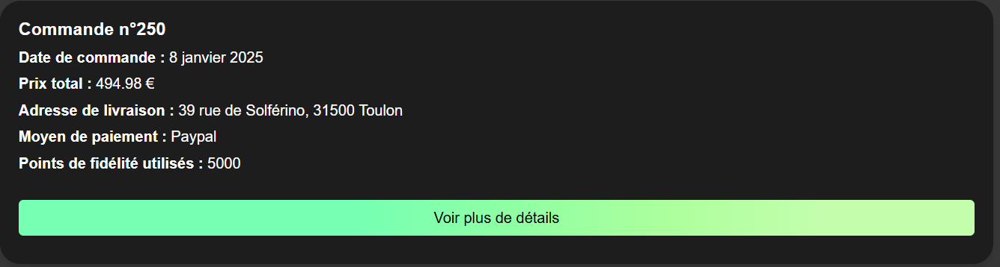
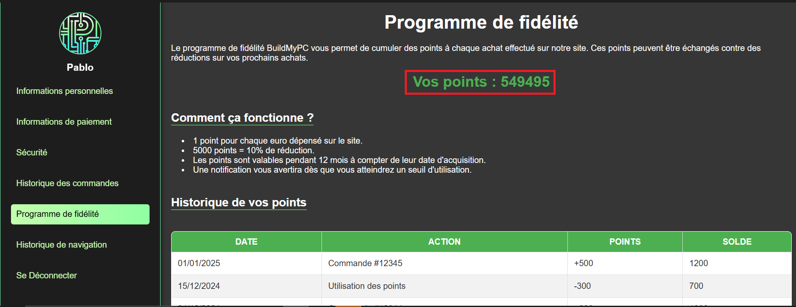
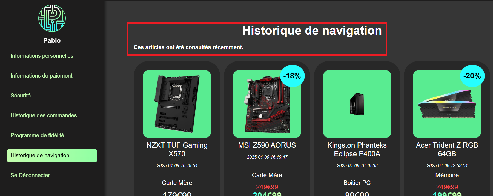

= Documentation utilisateur (client) du site web
:icons: font
:models: models
:experimental:
:incremental:
:numbered:
:toc: macro
:window: _blank
:correction!:

toc::[]

Version du site : V3.0 +
Date : 18/12/2024 +
Equipe : 1A-1 +
Client : BuildMyPC +
Projet : Site web e-commerce +

== Description du projet

=== Équipe

L'équipe était composée de cinq membres avec les rôles suivants :

- *Romain* : Product Owner et Développeur
- *Kilian* : Développeur
- *Titouan* : Développeur
- *Pablo* : Développeur
- *Hugo* : Scrum Master et Développeur

=== Contexte du projet

Le projet a pour objectif de développer une solution e-commerce pour l’entreprise **BuildMyPC**, spécialisée dans la vente de composants informatiques et d’ordinateurs montés. L’entreprise souhaite élargir son marché en passant d’un modèle B2B à une offre B2C, ciblant les particuliers pour augmenter sa visibilité et sa part de marché en Europe.

=== Objectifs du projet

**Problématique :**  
Garantir la fiabilité et l’efficacité du site web de e-commerce afin d’optimiser l’expérience utilisateur, d’améliorer la gestion des commandes et de répondre aux besoins des clients de manière rapide et intuitive, tout en respectant les contraintes techniques et opérationnelles.

**Objectif :**  

Validation technique :

- Assurer le bon fonctionnement de la navigation sur le site, y compris sur différents navigateurs et appareils (desktop, mobile).
- Vérifier l’intégration des bases de données pour le stockage des produits, commandes, et comptes utilisateurs.

Expérience utilisateur :

- Concevoir une interface ergonomique et intuitive pour permettre une navigation fluide et efficace.
- Mettre en place des fonctionnalités essentielles, telles que la recherche par catégorie, les filtres, et un processus de commande simplifié.

Affichage et contenu :

- Garantir un affichage rapide et cohérent des pages produit, des descriptions, et des visuels, même en cas de forte affluence sur le site.
- Optimiser le contenu pour une meilleure accessibilité et un référencement naturel (SEO) performant.

Fonctionnalités clés :

- Tester les mécanismes de gestion des paniers, des paiements sécurisés et des confirmations de commande en temps réel.
- Implémenter des outils de suivi des commandes et de communication avec les clients (notifications, suivi des livraisons).

Robustesse et sécurité :

- Renforcer la sécurité du site web pour protéger les données sensibles des utilisateurs (RGPD, protection contre les attaques).
- Garantir la disponibilité et la stabilité du site face à des pics de trafic ou à des interruptions techniques.

Alignement avec les objectifs de l’entreprise :

- Créer un site qui reflète les valeurs et les objectifs commerciaux de BuildMyPC.
- Permettre une gestion efficace des stocks et des commandes pour soutenir la croissance de l’activité e-commerce.

== Fonctionnement du projet Web

Pour des informations supplémentaires :

- Documentation technique : link:document_technique_web.adoc[Lien]

== Fonctionnalités pour les clients non connectés

=== Navigation et Recherche
- Page d'accueil

Pour lancer le site, il vous faudra entrer l'une des URL suivante:

Ou celle-ci:

Vous voila arriver sur la page d'accueil du site BuildMyPC.

- Recherche de produits

Pour rechercher un produit, vous pourrez utiliser la barre de recherche située dans la partie supérieure de la page d'accueil.

image::images/doc_user_web/search-bar.png[search-bar]

Une fois votre recherche tapée, vous avez le choix de supprimer la recherche ou de la valider. Pour valider, le bouton est fonctionnel, tout comme la touche "ENTRÉE".

Vous voilà désormais sur la liste des produits correspondant à votre recherche. Ici, un seul produit correspond à votre recherche.

image::images/doc_user_web/search-bar3.png[search-bar3]

Sur cette page, vous pouvez également affiner votre recherche en utilisant des filtres :

Vous avez ensuite la possibilité de trier les résultats selon plusieurs critères :

- Catégories de produits

Pour les catégories, vous pouvez les voir en haut de votre écran, sous la barre de recherche.

En survolant ces catégories, certaines afficheront un menu déroulant vous permettant de chercher dans les sous-catégories qui vous intéressent :

Sur la version mobile, les catégories seront accessibles depuis le bouton situé en haut à gauche de votre écran. De la même manière, vous pourrez cliquer sur les catégories qui vous intéressent.

Puis:

Sur la page d'accueil, vous avez aussi ces pannels cliquables:

=== Détails des Produits
- Page de détails du produit

=== Connexion et Inscription
- Formulaire de connexion

Si vous cliquez sur le bouton compte ou panier de la page principale(1) en n'étant pas connecté, vous serez redirigé vers le formulaire de connexion(2) ou vous serez inviter à entrer le mail ainsi que le mot de passe du compte auxquel vous voulez vous connecter.

En cas d'erruer ou de désactivation de compte, le formulaire vous l'informera via des messages rouge(3,4,5) présents sous les cases de connexion associées.

Si vous avez rentré une adresse mail et un mot de passe valide, vous serez renvoyé vers la page principale avec votre bouton compte changer avec le nom incrit pendant la création de votre compte (6).

Si sur le formulaire, vous souhaitez revenir à le page principale depuis le formulaire de connexion sans vous connecter, vous pouvez cliquer sur la flèche "back" (7) pour revenir en arrière.

Pour pouvoir acceder au formualire de création de compte depuis le formulaire de connexion, vous devrez cliquer sur le mot "ici" (8) mis en surbrillance.

image::images/doc_user_web/from_index_to_connexion.png[1]

(1 : bouton compte et panier)

image::images/doc_user_web/form_conn.png[2]

(2 : formulaire de connexion)

image::images/doc_user_web/err_log.png[3]

(3 : erreur identifiant incorrect)

(4 : erreur mot de passe incorrect)

(5 : erreur compte désactivé)

(6 : connexion réussite)

(7 : retour sur la page principale)

(8 : acces au formulaire de création de compte)

- Formulaire d'inscription

== Fonctionnalités pour les clients connectés

=== Gestion du Compte
- Consultation du compte

Lorsque vous êtes connecté, l'icône "Compte" s'affiche en couleur avec votre nom. Vous pouvez cliquer dessus pour voir deux options :

La première option vous permet de consulter votre profil, tandis que la seconde vous permet de vous déconnecter.

Une fois le bouton "Voir profil" cliqué, vous arrivez sur cette page contenant vos informations personnelles :

Vous pourrez cliquer sur le bouton "Modifier" :

Cela vous permettra de changer vos informations personnelles, ainsi que vos informations de livraison (votre adresse) :

- Sécurité

La section "Sécurité" vous permettra de changer votre mot de passe :

De même, vous pouvez modifier votre mot de passe en cliquant sur le bouton. Bien évidemment, celui-ci sera enregistré de manière sécurisée.

=== Gestion des Commandes
- Panier
- Historique des commandes

En cliquant sur la section "Historique des commandes", vous arriverez ici :

Vous verrez toutes vos commandes passées précédemment, et en cliquant sur "Détails commande", vous pourrez voir les articles commandés.

Voici l'interface que vous aurez :

=== Programme de Fidélité
- Points de fidélité

Pour le programme de fidélité, vous avez une page dédiée avec vos points affichés, une explication du fonctionnement et un historique des gains et utilisations de vos points.

=== Historique de Navigation
- Historique de navigation

Votre historique de consultations est disponible pour les 16 derniers articles visualisés.

Plus précisément, chaque article possédera ses attributs, ainsi que la date et l'heure de consultation. Vous aurez également la possibilité de le supprimer de votre historique de consultation.

== Support et Contact
Pour toute question ou assistance, veuillez contacter notre support client à l'adresse suivante: *support@buildmypc.com*

== Conclusion
Nous espérons que cette documentation vous aidera à tirer le meilleur parti du site web BuildMyPC.
